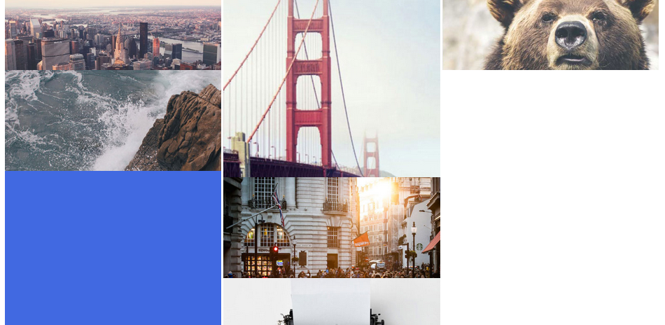

### Responsive HTML and CSS page

### About
* Responsive webpage written in pure HTML and CSS
* It may be necessary to refresh after a page break to see the responsive effect.

### Features
* Two break-points where the layout changes according to screen width (there are separate layouts for mobile, tablet and desktop)
* Vertically-centered text and images (on the "follow-about-explore" navigation and "portfolio" image block)
* Rudimentary use of Block-Element-Modifier principles
* A maximum width has been applied to the whole body prevent the images looking too stretched on very wide desktops.
* Styling denotes clickable items (I have assumed the expected behaviour is that images are linked to other assets (lightboxes or other pages, for example) and highlighting these with a pointer cursor and increased opacity assists the user experience). It also allows the user to keep track of their cursor in a dense image wall.

### Notes

##### General
Most of the day I allowed myself for these two tasks was spent on this exercise. It took longer than expected to reach even this level of (partial) completion.

##### Layout
The decision was made to group the "image block" into three columns. Please see [Layout Decision](#layout-decision).

##### Images
Firstly, divs with background images are used here (instead of placing images directly in the HTML) mostly as a force of habit. I find it useful to control images in one place and provide fallbacks if needed (in conjunction with something like Modernizr for feature detection) for older browsers or where smaller/higher quality/different assets need to be served. A good example of this is icon SVGs, which will not display in IE8 and require png fallbacks.

The header and footer images are in the HTML so they retain their aspect ratios and take up the space they need in the DOM without having to fiddle with percentage heights.

I would probably use a plugin for an image wall (eg Masonry) to move the images around to fit in the best way when the screen is resized; to calculate widths and heights if they are added dynamically. Also, there are things like [FocusPoint](https://github.com/jonom/jquery-focuspoint) which will center-in on the subject of the picture when the full image cannot be displayed.

At mobile size is when things start getting a bit uncomfortable. The portrait-oriented image gets as much headroom as the landscape images. This would be an instance where having the images in the HTML would be better (within the scope of this exercise).

### Improvements

As you will notice, there is an instance where a block cannot contain all its text, and in many cases images are cut off or skewed. As mentioned, I would use other tools for resizing, positioning and focusing images on the image wall. The reason for the 40/60 split of columns 1 and 2 at medium screen size, for example, is purely because I know there is a portrait image in column 1.

I would use SVGs for the icons. I do not have software to create them, so I have put the icons in at a fixed size so they don't stretch and look blurry when the screen is very large.

I created this webpage in Chrome. I would use virtual machines (eg VirtualBox) or Browserstack (if actual devices/ operating systems are not available) to test in other browsers and devices.

I have not provided alt text for the images. This is terrible for accessibility purposes.

If LESS or Sass were permitted, I would create a vertical alignment mixin and some variables for colours. Here, where there is repetition it's for the sake of speed and wanting to keep the HTML free of too many messy classes.


### Layout decision
Options for achieving this:
```
 _______________
|  1  | 2 |  3  |
|_____|   |_____|
|  4  |___|  5  |
|_____|_6_|_____|

```
instead of this:
```
________________
|  1  | 2 |  3  |
|_____|   |_____|
 _____|___|_____
|  4  |___|  5  |
|_____|_6_|_____|

```
are:

1. jQuery plugin (such as Masonry)
2. position absolutely
3. CSS3 columns (column-count etc)
4. CSS inline-block columns

##### CSS3 column attempt:

